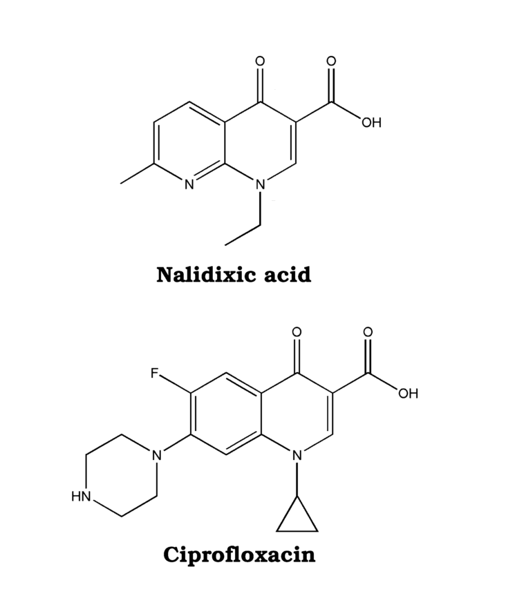

# Introduction

## _Escherichia coli_

### General bacteriology and ecology
The genus _Escherichia_ has been known since 1985 [@Farmer1985], but it was Theodor Escherich that first identified, in 1985, the species _Bacterium coli_, later called _Escherichia coli_ [@Escherich1989]. _Escherichia coli_ (_E. coli_) is the most studied microorganism on earth [@Vila2016], and is often used as a model organism in various microbiology studies and surveillance. _E. coli_ is a gram-negative, rod-shaped, facultative anaerobic bacteria often found in the gastrointestinal tract of warm-blooded animals and humans. There, it may be present as a commensal or as a pathogen. The presence of _E. coli_ in the gastrointestinal tract has been attributed to the relationship between body mass and gut transit times [@Gordon2003], and the probability of detecting _E. coli_ increases with the body size of the host. Thus, the prevalence of _E. coli_ is higher in larger mammals. Also, gut morphology seem to play a role in the prevalence of _E. coli_ [@OBrien2011].

### Population structure
The _E. coli_ population is generally regarded to have a clonal structure [@Tenaillon2010]. Multiple stable lineages, also known as clones, have been found to exist within the _E. coli_ species, among which very little recombination occurs. These stable lineages are known as phylogroups, specifically A, B1, B2, C, D, E, and F (Figure \@ref(fig:popstructure)), based on the presence and absence of specific genes [@Clermont2013]. The molecular variability within these lineages have been postulated to be neutral in terms of organism fitness, and thus not affected by natural selection [@Selander2007].

```{r, fig.cap="\\label{fig:popstructure}Phylogenetic history of \\textit{Escherichia coli}, reprinted with permission from Springer Nature \\citep{Tenaillon2010}", out.width="14cm", out.height="14cm", echo=FALSE, message=FALSE, fig.align='center'}
knitr::include_graphics("images/pop_structure.png")
```

## Monitoring antimicrobial resistance
As part of the Norwegian government's strategy plan against antimicrobial resistance, the Norwegian monitoring programme for antimicrobial resistance in feed, food and animals (NORM-VET) was implemented in 2000. This programme has since 2014 followed the recommendations for surveillance as given by the EU (2013/652/EU) in parallell with national surveillance needs. NORM-VET reports antimicrobial usage as well as resistance, and the data generated serves as a baseline for specific research projects. Yearly reports are published in collaboration with NORM, which monitors antimicrobial resistance in pathogenic bacteria from humans. 

## Quinolones and Fluoroquinolones
Quinolones are synthetic antimicrobials that were introduced to the market in the late 1960s [@Emmerson2003]. The first quinolone, Nalidixic acid (Figure \@ref(fig:cipnal)), was discovered as a byproduct of chloroquine synthesis [@Lesher1962], and was clinically in use in 1967. A few decades later, the synthesis of novel quinolones increased the effectiveness of nalidixic acid towards gram-positive bacteria, and reduced its toxicity by altering its chemical structure. This structural change involved, among others, the addition of a fluoro-group to the molecule, which also increased its potency towards _Enterobacteriaceae_ [@Emmerson2003]. This also lead to a change in nomenclature for these compounds, as the molecules that harbored this structural change now were called fluoroquinolones.
Ciprofloxacin (Figure \@ref(fig:cipnal)), a well known fluoroquinolone, is often used in human medicine, and have been listed on World Health Organization (WHO) list of essential medicines up until today [@WHO2015]. In veterinary medicine, the fluoroquinolone enrofloxacin is regularly used.

```{r, fig.cap="\\label{fig:cipnal}Ciprofloxacin and Nalidixic acid molecules", out.width="5cm", out.height="6cm", echo=FALSE, message=FALSE, fig.align='center', fig.pos="H"}

```

The main target for quinolones and fluoroquinolones (hereafter called quinolones) in _E. coli_, is the type II topoisomerases DNA gyrase (also known as topoisomerase II) and topoisomerase IV [@Drlica1997]. The type II topoisomerases regulate DNA topology by cutting DNA strands, passing another DNA strand through the break, and then seal the break [@Hooper1998]. Both DNA gyrase and Topoisomerase IV is comprised of two subunits, A and B. These are encoded by the genes _gyrA_ and _gyrB_ for DNA gyrase, and _parC_ and _parE_ for topoisomerase IV. The type II topoisomerases are the main target for quinolones in _E. coli_, especially the DNA gyrase. Quinolones bind to these enzymes through a water-metal ion bridge (Figure \@ref(fig:watermetalion)), connecting the quinolone molecule to two specific amino acids; ser 83 and asp 87 in DNA gyrase, and ser 80 and glu 84 in topoisomerase IV [@Aldred2014]. This binding inhibits the ligation function of the enzyme, and fragments the bacterial chromosome, leading to cell death.

```{r, fig.cap="\\label{fig:watermetalion}The binding of ciprofloxacin to topoisomerase IV through the water-metal ion bridge", out.width="5cm", out.height="6cm", echo=FALSE, message=FALSE, fig.pos="H"}
knitr::include_graphics("images/watermetalion.jpg")
```


## Quinolone resistance mechanisms in _E. coli_

Multiple mechanisms that infer resistance towards quinolones have been discovered in _E. coli_, and they are generally dividied into four categories: target-site gene mutations, reduced membrane permeability, efflux pump overexpression, and plasmid mediated quinolone resistance (PMQR)[@Correia2017,@Aldred2014a], see Figure \@ref(fig:mechanisms).

```{r, fig.cap="\\label{fig:mechanisms}Quinolone resistance mechanisms, reprinted with permission from Microbiology Society \\citep{Correia2017}", out.width="14cm", out.height="10cm", echo=FALSE, message=FALSE, fig.pos="H"}
knitr::include_graphics("images/mechanisms.jpg")
```

### Target-site gene mutations
Perhaps the most known resistance mechanism towards quinolones is mutations in the genes that code for the target molecules, _gyrA_, _gyrB_, _parC_, and _parE_. Missense mutations in these genes that lead to a substitution of critical amino acids needed for the binding of quinolones to the target molecules may lead to an increased tolerance towards these compounds. In _E. coli_, substitutions in a stretch of amino acids known as the "quinolone resistance determining region" (QRDR) in these four genes is highly correlated with quinolone resistance. In GyrA, this region is between amino acid (AA) 67 to 106 [@Yoshida1991], in GyrB between AA 333 and 481, ParC between AA 51 and 170, and ParE between AA 366 and 523. <!--need reference here! --> Specific substitutions within these areas are often identified in QREC, e.g. the serine 83 and aspartic acid 87 positions in GyrA [@Barnard2001], or the serine 80 position in ParC. 

### Reduced membrane permeability
Porin channels in the bacterial membrane are essential for the entry of quinolones into the cell [@Correia2017]. Specific chromosomal regulons are involved in the expression of these membrane proteins, exemplified by mutations in the Mar, SoxRS and Rob regulons [@Correia2017]. These mutations may decrease the expression of the Omp-type porins, or prevent _ompF_ mRNA expression.

Plasmid-mediated _qnr_-genes, _mfp_-genes, _mcbG_. Compromised structure of the quinolone molecule by the acetyltransferase _aac(6')-ib-cr_.

### Reduced drug accumulation
Over-expression of efflux pumps and reduced expression of porins (Mutations in _marR_, plasmid-mediated efflux pumps: _oqxAB_).

## Epidemiology of quinolone resistant _E. coli_

## Genomic Analysis
Ever since the eve of high-throughput sequencing platforms in the early 2000s, bioinformatics have become increasingly needed to handle the massive amount of generated data. Bioinformatics can be defined as the use of informatics techniques, such as mathematics, statistics and computer science, to understand biological data on a large scale [@Luscombe2001]. In most cases, DNA or protein sequences represent the biological data, but gene expression data can also be analysed. 
