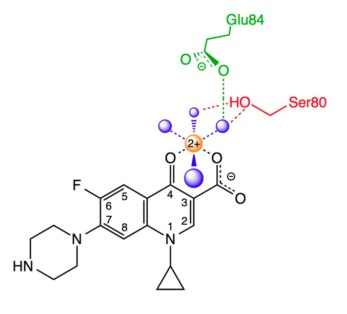
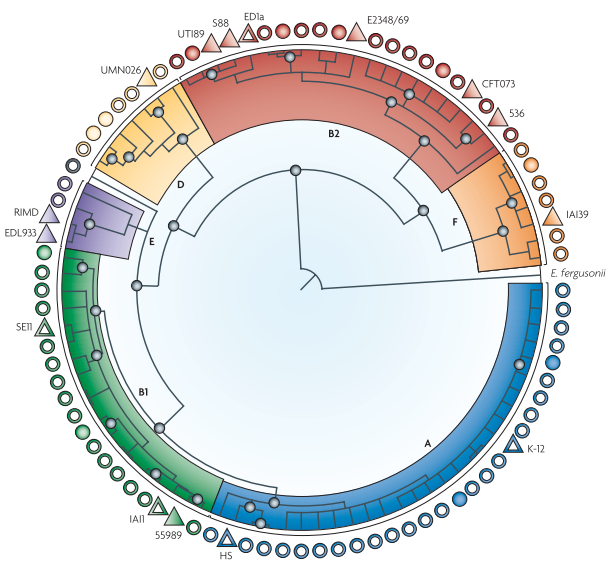

# Introduction

## Norwegian husbandry

### Broiler production
The Norwegian broiler production is a pyramidal structure with the broilers at the bottom and purebred animals at the top [@Mo2016a]. Hatching eggs are imported from grandparent animals in Sweden which originate mostly from Scotland or Germany. The eggs are hatched in Norwegian hatcheries, and become parent animals. These are reared for around 18 weeks, and are subsequently used for breeding of broiler chickens until around 60 weeks old. The broiler chickens are hatched in hatcheries, and distributed to broiler farms all over the country. Only a few hatcheries exist in Norway. Broiler chickens are reared for 28 - 32 days, depending on weight, then slaughtered [@Nortura2019]. Broiler farms are heated and closed from the outside environment. Also, a maximum of 36 kg of chickens are allowed per square meter, which is less than in other EU countries [@Nortura2019].

### Swine production


### Other animals
Norwegian cattle is produced in two ways: either by milk production or by cattle that is not used for milk production. Dairy cows covers approximately 70% of beef on the Norwegian market [@Nortura2019b], and are slaughtered at around four years of age. The remaining 30% of the beef on the market is from cows that are not used for milk production, which are slaughtered at 16 - 18 months of age.

Sheep are left grazing in outlying fields most of the year, but are kept inside during the winter season. Similar to dairy cows, they are slaughtered at around four years of age [@Nortura2019c].

## Antimicrobial resistance
Multiple definitions on antimicrobial resistance exist. In a clinical setting, antimicrobial resistance is defined as the ability of microorganisms to change in response to the presence of antimicrobials or other factors. This change makes the microorganism able to survive antimicrobial treatment [@WHO2018]. In a laboratory setting, the microorganism is regarded as resistant if it grows in the presence of antimicrobials at a higher concentration than the wild-type <!-- Need ref! --> . The discovery of antimicrobials in the early 20th century revolutionized medicine, and the discovery of Penicillin in 1928 by Sir Alexander Fleming and subsequent production in the late 1940s was the turning point for treating bacterial infections. However, already in 1945, Alexander Fleming warned about the mis-use of antimicrobials, stating that exposing bacteria to sub-lethal concentrations in the lab rendered them resistant, and that this also may happen in the body [@Fleming1945].

> *"It is not difficult to make microbes resistant to penicillin in the laboratory by exposing them to concentrations not sufficient to kill them, and the same thing occasionally happened in the body"*
>
> `r tufte::quote_footer("--- Sir Alexander Fleming, Nobel lecture, 1945")`

Systematic misuse of antimicrobials have been attributed to the increased emergence of AMR [@WHO2015a]. To tackle this problem, the World Health Organization (WHO) has implemented a Global Action Plan in 2015 to increase knowledge about AMR and provide guidance for the optimal use of antimicrobial agents [@WHO2015a]. Exposing bacteria to sub-lethal concentrations of antimicrobial compounds is known to generate resistant phenotypes. However, resistance to antimicrobial compounds have been found in prehistoric microbial samples [@Dcosta2011], suggesting that antimicrobial resistance is a natural phenomenon. Other factors, such as environmental stress factors, is also linked to the development of AMR in the absence of antimicrobial selective pressure [@McMahon2007,@Poole2012].

## Monitoring antimicrobial resistance

### Antimicrobial resistance surveillance
Harmonized monitoring of AMR in commensal _E. coli_ from food and food-producing animals has since 2014 been obligatory for all EU/EEA member states, as implemented by the European Commission (SANCO/11591/2012). The commission describes the sampling frame and analysis of isolates. Commensal _E. coli_ is usually isolated from caecal samples, and antimicrobial susceptibility testing (AST) is carried out using broth microdilution. With this method, the minimum inhibitory concentration (MIC) value is determined for multiple antimicrobials. A MIC value is defined as the lowest concentration of the antimicrobial needed to inhibit growth of a microorganism [@Andrews2001]. Certain thresholds have been defined when categorizing isolates from AST results, based on MIC values. Usually, microorganisms are defined as sensitive (wild type), intermediate, or resistant. These definitions all rely on the MIC values to their respective antimicrobials, based on guidelines from the European Committe on Antimicrobial Susceptibility Testing (EUCAST, www.eucast.org). If resistance is acheieved by a single step, for example by chromosomal mutation or acquisition of a plasmid, the isolate may be expected to fall into two groups, either sensitive or resistant. However, if resistance is achieved in a step-wise fashion, the isolate may fall somewhere in between these two groups [@Bywater2006]. To separate the intermediate isolates from the sensitive, the epidemiological cut-off value (ECOFF) was implemented. The ECOFF is defined as the MIC value above the distribution of MIC values for the sensitive isolates, see Figure \@ref(fig:ecoff). It is important to distinguish between resistant isolates and intermediate isolates, as the intermediate isolates may still respond in a clinical setting. However, monitoring this group of isolates is important, as they may easily become resistant with the acquisition of additional resistance mechanisms.

For simplicity, in this thesis, all _E. coli_ isolates are coined as resistant if they have a MIC value above the ECOFF.

```{r, fig.cap="\\label{fig:ecoff}Distribution of MIC-values for ciprofloxacin in E. coli. Data: www.eucast.org.", echo=FALSE, message=FALSE, fig.pos="H", fig.align="center"}
knitr::include_graphics("images/micdist.jpg")
```

### The Norwegian monitoring programme
As part of the Norwegian government's strategy plan against antimicrobial resistance, the Norwegian monitoring programme for antimicrobial resistance in feed, food and animals (NORM-VET) was implemented in 2000. The National Institute of Nutrition and Seafood Research, the Norwegian Food Safety Authority, and the Norwegian Veterinary Institute are all participants in this programme. The programme has since 2014 followed the recommendations for surveillance as given by the EU (2013/652/EU) in parallel with national surveillance needs. NORM-VET reports antimicrobial usage as well as resistance, and the data generated serves as a baseline for specific research projects. Yearly reports are published (https://www.vetinst.no/en/surveillance-programmes/norm-norm-vet-report) in collaboration with NORM, which monitors antimicrobial resistance in pathogenic bacteria in humans. A variety of animal species have been sampled in NORM-VET, including cattle, pigs, dogs, broilers, layers, horses, red foxes, reindeer, sheep, turkeys, and multiple wild bird species. Not all animal species are sampled each year, due to the NORM-VET sample regime. The sample material is commonly faecal or caecal matter, but meat and boot swab samples are also included some years. In broiler and turkey flocks, 10 samples were collected from each flock. The 10 samples are then pooled before culturing.

Culturing and isolation methods have been used to identify _E. coli_ from the samples collected. These isolates are used as an indicator for the presence of resistance in the sampled animal's microflora. Quinolone resistance in indicator _E. coli_ has been monitored in NORM-VET since 2000. First, samples are plated onto lactose-bromothymol blue agar (pre-2013) or MacConkey agar (2013 until today). Then, a random _E. coli_ colony is subjected to susceptibility testing. In 2014, a selective method was introduced. Here, the samples were plated onto MacConkey agar with 0.06 mg/L ciprofloxacin, which is the ECOFF for ciprofloxacin in _E. coli_ as defined by EUCAST. Similar to the method above, one random colony of _E. coli_ was selected and subjected to susceptibility testing. Susceptibility testing was done by broth microdilution.

Prophylactic use of antimicrobial compounds in Norwegian livestock is prohibited, and is only used to treat diseased animals. The use of quinolones to treat livestock in Norway is very low, see Figure \@ref(fig:quinUsage) [@NORM/NORM-VET2017].

```{r, fig.cap="\\label{fig:quinUsage}Overall sales, in kg active substance, of quinolones and macrolides for therapeutic use in terrestrial livestock animals in Norway in 1993 - 2017, reprinted with permission \\citep{NORM/NORM-VET2017}.", echo=FALSE, message=FALSE, out.width="95%"}
knitr::include_graphics("images/quin_usage.png")
```


## Quinolones and Fluoroquinolones
Quinolones are synthetic antimicrobials that were introduced to the market in the late 1960s [@Emmerson2003]. The first quinolone, Nalidixic acid, was discovered as a byproduct of chloroquine synthesis [@Lesher1962], and was clinically in use in 1967. A few decades later, the synthesis of novel quinolones increased the effectiveness of nalidixic acid towards gram-positive bacteria, and reduced its toxicity by altering its chemical structure. This structural change involved, among others, the addition of a fluoro-group to the molecule, which also increased its potency towards _Enterobacteriaceae_ [@Emmerson2003]. This also lead to a change in nomenclature for these compounds, as the molecules that harbored this structural change now were called fluoroquinolones.
Ciprofloxacin, a well known fluoroquinolone, is often used in human medicine, and have been listed on World Health Organization (WHO) list of essential medicines up until today [@WHO2015]. In veterinary medicine, the fluoroquinolone enrofloxacin is regularly used.

The main target for quinolones and fluoroquinolones (hereafter called quinolones) in _E. coli_, is the type II topoisomerases DNA gyrase (also known as topoisomerase II) and topoisomerase IV [@Drlica1997]. The type II topoisomerases regulate DNA topology by cutting DNA strands, passing another DNA strand through the break, and then seal the break [@Hooper1998]. Both DNA gyrase and Topoisomerase IV is comprised of two subunits, A and B. These are encoded by the genes _gyrA_ and _gyrB_ for DNA gyrase, and _parC_ and _parE_ for topoisomerase IV. The type II topoisomerases are the main target for quinolones in _E. coli_, especially the DNA gyrase. Quinolones bind to these enzymes through a water-metal ion bridge (Figure \@ref(fig:watermetalion)), connecting the quinolone molecule to two specific amino acids; ser 83 and asp 87 in DNA gyrase, and ser 80 and glu 84 in topoisomerase IV [@Aldred2014]. This binding inhibits the ligation function of the enzyme, and fragments the bacterial chromosome, leading to cell death.


```{r, fig.cap="\\label{fig:watermetalion}Overview of the water-metal ion bridge that mediates the quinolone-topoisomerase IV interaction, reprinted with permission from the American Chemical Society \\citep{Aldred2014}.", out.width="8cm", out.height="8cm", echo=FALSE, message=FALSE, fig.align='center'}

```

## _Escherichia coli_

### General bacteriology and ecology
The genus _Escherichia_ has been known since 1985 [@Farmer1985], but it was Theodor Escherich that first identified, in 1985, the species _Bacterium coli_, later called _Escherichia coli_ [@Escherich1989]. _Escherichia coli_ (_E. coli_) is the most studied microorganism on earth [@Vila2016], and is often used as a model organism in various microbiology studies and surveillance. _E. coli_ is a gram-negative, rod-shaped, facultative anaerobic bacteria often found in the gastrointestinal tract of warm-blooded animals and humans. There, it may be present as a commensal or as a pathogen. The presence of _E. coli_ in the gastrointestinal tract has been attributed to the relationship between body mass and gut transit times [@Gordon2003], and the probability of detecting _E. coli_ increases with the body size of the host. Thus, the prevalence of _E. coli_ is higher in larger mammals. Also, gut morphology seem to play a role in the prevalence of _E. coli_ [@OBrien2011].

### Population structure
The _E. coli_ population is generally regarded to have a clonal structure [@Tenaillon2010]. Multiple stable lineages, also known as clones, have been found to exist within the _E. coli_ species, among which very little recombination occurs. These stable lineages are known as phylogroups, specifically A, B1, B2, D, E, and F (Figure \@ref(fig:popstructure)), based on the presence and absence of specific genes [@Clermont2013]. The molecular variability within these lineages have been postulated to be neutral in terms of organism fitness, and thus not affected by natural selection [@Selander2007].

```{r, fig.cap="\\label{fig:popstructure}Phylogenetic history of \\textit{Escherichia coli}, reprinted with permission from Springer Nature \\citep{Tenaillon2010}.", out.width="14cm", out.height="14cm", echo=FALSE, message=FALSE, fig.align='center'}

```

## Quinolone resistance mechanisms in _E. coli_

Multiple mechanisms that infer resistance towards quinolones have been discovered in _E. coli_, and they are generally divided into four categories: chromosomal mutations, reduced membrane permeability, efflux pump over expression, and plasmid mediated quinolone resistance (PMQR)[@Correia2017,@Aldred2014a], see Figure \@ref(fig:mechanisms).

```{r, fig.cap="\\label{fig:mechanisms}Quinolone resistance mechanisms, reprinted with permission from Microbiology Society \\citep{Correia2017}.", out.width="14cm", out.height="10cm", echo=FALSE, message=FALSE, fig.pos="H", fig.align="center"}
knitr::include_graphics("images/mechanisms.jpg")
```

### Chromosomal mutations
Perhaps the most known resistance mechanism towards quinolones is mutations in the genes that code for the target molecules, _gyrA_, _gyrB_, _parC_, and _parE_. Missense mutations in these genes that lead to a substitution of critical amino acids needed for the binding of quinolones to the target molecules may lead to an increased tolerance towards these compounds. In _E. coli_, substitutions in a stretch of amino acids known as the "quinolone resistance determining region" (QRDR) in these four genes is highly correlated with quinolone resistance. In GyrA, this region is between amino acid (AA) 67 to 106 [@Yoshida1991], in GyrB between AA 333 and 481, ParC between AA 51 and 170, and ParE between AA 366 and 523. Specific substitutions within these areas are often identified in QREC, e.g. the serine 83 and aspartic acid 87 positions in GyrA [@Barnard2001], or the serine 80 position in ParC. Mutations in one type II enzyme usually confers a 10 fold increase or less in drug resistance, while mutations in both is often found in isolates with 10-100 fold increase in drug resistance [@Aldred2014a].

Favourable mutations, such as those conferring antimicrobial resistance, are relatively rare. However, some bacteria are hypermutators with an elevated mutation rate [@Gross1981]. This elevated mutation rate may be due to the presence of mutator alleles, which can accelerate adaptation and increase the chance for a favorable mutation [@Taddei1997]. Mutations in mutator genes such as _mutS_, _mutL_, and _uvrD_ have been shown to increase MIC-values towards ciprofloxacin in _Pseudomonas aeruginosa_ [@Wiegand2008]. These genes code for proteins that either corrects mismatched DNA produced by multiple mechanisms [@Modrich1989], or have proof-reading activity.

### Reduced membrane permeability
Porin channels in the gram negative bacterial membrane are essential for the entry of quinolones into the cell [@Correia2017]. Specific chromosomal regulons are involved in the expression of these membrane proteins, exemplified by the _mar_, _soxRS_ and _rob_ regulons [@Correia2017]. Mutations in these genes may decrease the expression of the Omp-type porins, or prevent _ompF_ mRNA expression, which in turn reduces the drug concentration in the cell [@Oethinger1998,@Cohen1989,@Koutsolioutsou2005,@Amabile-Cuevas1991,@White1997]. Mutations in the regulator gene _soxR_ may alter the expression of _soxS_, which then may regulate the expression of _micF_ in response to superoxide stress, which prevents the _ompF_ mRNA expression [@Amabile-Cuevas1991]. Reduced expression of the membrane porins OpmF, OmpC, OmpD and OmpA have been linked to resistance towards quinolones and other antimicrobials [@Bore2007]. 

### Efflux pump overexpression
In _E. coli_, the AcrAB-TolC efflux pump have been identified as a major facilitator of quinolone efflux [@Sato2013,@Weston2017]. Mutations in specific regulatory genes such as _marR_ may activate _acrAB_ and _tolC_, thus increasing their expression [@Alekshun1999a]. This will in turn reduce the drug concentration in the cell. Certain mutations in RNA polymerase subunit B (_rpoB_) have been shown to increase the expression of MdtK, which is a multidrug efflux transporter, resulting in an increase in levofloxacin MIC values [@Pietsch2017a].

### Plasmid mediated quinolone resistance
Some proteins that infer resistance to quinolones are transcribed from plasmids, such as the quinolone resistance proteins (Qnr), the efflux pumps OqxAB and QepA, and the acetyltransferase Aac(6')-ib-cr.

The Qnr proteins are pentapeptide proteins that are capable of protecting the DNA gyrase and/or topoisomerase IV from quinolone action. The Qnr protein binds to the topoisomerase and prevents the quinolone from stabilizing the lethal gyrase-DNA-quinolone cleavage complex [@Tran2005,@Tran2005a,@Robicsek2006], thus effectively reducing the possible targets for the quinolones. Multiple subtypes of the Qnr proteins have been identified, namely QnrA, QnrB, QnrC, QnrD, QnrS, and QnrVC [@Strahilevitz2009], based on their amino acid sequence. The origin of these proteins is mostly unknown, but variants of the _qnrA_ gene have been identified in the chromosome of _Shewanella algae_, a water-dwelling bacterium, suggesting a reservoir for these proteins [@Poirel2005b]. Other PMQR genes have been identified, such as _mfpA_, _mfpA~MT~_, and _mcbG_. Similar to the _qnr_ genes, _mfpA_ codes for a pentapeptide protein with 18.9% sequence similarity with QnrA [@Strahilevitz2009]. The expression of _mfpA_ seem to confer a four- to eightfold increase in MIC values toward ciprofloxacin [@Montero2001b]. The mechanism by which MfpA confers resistance to quinolones is thought to be similar to the Qnr proteins, by binding to the topoisomerase and effectively protecting them from quinolone action [@Hegde2005]. Similarly, _mcbG_ codes for a pentapeptide repeat protein with 19.6% sequence similarity to QnrA. However, this protein seem to protect the DNA gyrase from the inhibitory action of microcin, which is a peptide antibiotic [@Garrido1988]. The mechanism by which the protein protects DNA gyrase is currently unknown.

The efflux pump OqxAB have been shown to increase resistance towards chloramphenicol and quinolones, and is dependent on the host TolC outer membrane protein in _E. coli_ [@Hansen2004,@Hansen2007]. Similarly, QepA have been found to increase resistance towards ciprofloxacin, norfloxacin and enrofloxacin due to efflux [@Yamane2007]. Interestingly, since quinolones are synthetic antimicrobials, innate transporters for quinolones were not expected to exist in nature. However, it has been speculated that these pumps have evolved as a response to molecules with a structural similarity to quinolones [@Yamane2007].

The acetyltransferase AAC(6')-Ib-cr infers resistance towards quinolones by altering the quinolone molecule itself. The enzyme acetylates the amino nitrogen on the piperazinyl substituent of ciprofloxacin and norfloxacin [@Robicsek2006a]. This compromised structure reduces the activity of the quinolone [@Robicsek2006a]. The AAC(6')-Ib-cr enzyme is a variant of the AAC(6')-Ib proteins, with the specific substitutions W102R and D179Y that are necessary for quinolone resistance [@Robicsek2006a]. Expression of this protein usually leads to a relatively low MIC-value, approximately three- to fourfold increase towards ciprofloxacin and norfloxacin [@Strahilevitz2009]. The increase in MIC conferred by this enzyme is generally lower than the Qnr proteins, mostly due to substrate specificity.


## Epidemiology of quinolone resistant _E. coli_

### In Norway
QREC from a variety of animals have been monitored in NORM-VET since 2006<!--sjekk med AM-->. In Norway, the occurrence of QREC seem to have an interspecies variation, with the highest occurrence in broilers and wild birds [@Kaspersen2018]. Additionally, the prevalence in broilers from 2006 to 2016 seem to be varying, with an increasing trend from 2011 to 2016 [@Kaspersen2018]. However, the occurrence of QREC in Norway is relatively low when compared to other European countries.


```{r, fig.cap="\\label{fig:qrecEpi}Percent occurrence of QREC per animal species. Illustration: H. Kaspersen.", echo=FALSE, message=FALSE, fig.pos="H", fig.align="center"}
knitr::include_graphics("images/qrec_epi.png")
```

### In Europe
The occurrence of QREC in livestock in Europe is markedly different than the situation in Norway.

```{r, fig.cap="\\label{fig:ecdcData}Mean occurrence of quinolone resistance in indicator E. coli from 2014 - 2017. Data taken from European Union summary reports on antimicrobial resistance in zoonotic and indicator bacteria from humans, animals and food 2014 - 2017 \\citep{EFSA2016b,Food2017,Food2018,Food2019}. Illustration: Håkon Kaspersen", echo=FALSE, message=FALSE, fig.pos="H", fig.align="center", out.width="150%"}
knitr::include_graphics("images/ecdcdata.png")
```

## Genomic Analysis

<!-- introduction to bioinformatics -->
<!-- sequencing technology -->
<!-- library prep -->
<!-- read length -->
<!-- paired-end etc -->
<!-- Analysis of sequence reads -->
<!-- Quality control -->
<!-- assembly -->
<!-- post-assembly analysis -->
<!-- mapping-based analysis -->
<!-- databases -->
<!-- phylogenetic analysis -->


The process of analysing genomic data can be compared to piecing together shredded paper - the genomic DNA is fragmented, sequenced, then put together again. Afterwards, the assemblies are analysed in various aspects. Ever since the eve of high-throughput sequencing platforms in the early 2000s, bioinformatics have become increasingly needed to handle the massive amount of generated data. Bioinformatics can be defined as the use of informatics techniques, such as mathematics, statistics and computer science, to understand biological data on a large scale [@Luscombe2001]. In most cases, DNA or protein sequences represent the biological data, and is widely used in phylogenetic analysis, gene identification, and other analyses. In this chapter, the process of genomic analysis is presented in detail.

### High-throughput sequencing
Following the sequencing of the Human Genome in 2004 with Sanger sequencing, a multi-million dollar sequencing initiative formed [@Schloss2008], resulting in the emergence of multiple high-throughput sequencing (HTS) technologies. Throughout the years, Illumina has quickly become the dominant short-read technology by which high-throughtput sequencing have developed. With the MiSeq, HiSeq and NextSeq sequencers, HTS has rapidly become both cheaper and more efficient. The MiSeq sequencer has been readily used for bacterial genomes, due to the relatively fast instrument run time and the small size of the genomes [@Reuter2015]. The strength of this technology is the massive parallellization of the sequencing process, quickly generating gigabytes of data. Other sequencing companies exist, but Illumina is the dominant on the market for short read sequencers. Companies like Pacific Biosciences and Oxford Nanopore have sequencers specifically for long-read technology.

The process of Illumina HTS builds upon that of Sanger sequencing. First, genomic DNA is extracted and purified to adequate quality. The genomic DNA (gDNA) is then fragmented and enriched either by PCR or by hybridization [@Morey2013], through a process called library preparation. Here, the genomic DNA is fragmented by either mechanical shearing or by enzymes. Adapters are then placed on each end of each DNA fragment, then amplified. Then, the prepared fragments are placed on a flowcell coated with a lawn of adapter oligos, and a clonal array is generated by bridge PCR [@Morey2013], see Figure \@ref(fig:seqmet). The DNA fragments are denatured, then bind to the flow cell oligonucleotides by the attached adapters. The free end of the DNA fragment then hybridize to an adjacent oligonucleotide. Then, the polymerase extends the oligonucleotide to form a double-stranded fragment. The fragments are then denatured, resulting in two separate fragments relatively close to each other. This is then repeated to form clusters of fragments on the flowcell. This is done to amplify the signal for the sequencer to detect. Afterwards, sequencing-by-synthesis is performed to identify the bases in each DNA fragment. First, the reverse strands created in the clustering step is washed away. The fragments are then polymerized to a given length by incorporating fluoresence labelled bases, which are registered by the instrument. The length of the polymerization depends on the sequencer and what the user has specified. In most cases, the read length is between 100 - 250 base pairs [@Illumina2019]. When the forward strands have been sequenced, a new bridge PCR takes place, and the forward strands are cleaved off. The reverse strands are then sequenced in the same manner as the forward strands [@Illumina2019].

```{r, fig.cap="\\label{fig:seqmet}Steps in Illumina sequencing; A: Generation of the clonal array by bridge PCR. B: Sequencing by synthesis, which takes place in the clonal clusters created in A. Modified and reprinted with permission from Elsevier \\citep{Morey2013}.", echo=FALSE, message=FALSE, fig.pos="H", fig.align="center", out.width="90%"}
knitr::include_graphics("images/seqmet.jpg")
```

### Analysis of sequence reads
Raw reads from the sequencer can be analysed in multiple ways, illustrated in Figure \@ref(fig:bioinfo). Raw reads are quality controlled, to check the quality of the read bases and remove bad quality reads. This is usually done by programs such as fastQC (https://www.bioinformatics.babraham.ac.uk/projects/fastqc/) and Trimmomatic [@Bolger2014]. Afterwards, the reads are used to stitch the genome back together, a process called genome assembly.

```{r, fig.cap="\\label{fig:bioinfo}Main analysis pathway for culture-based genomic data, reprinted and modified with permission from Springer Nature \\citep{Boolchandani2019}.", echo=FALSE, message=FALSE, fig.pos="H", fig.align="center", out.width="110%"}
knitr::include_graphics("images/bioinfo.jpg")
```

Before delving into genome assembly paradigms, it is important to note that genome assemblies are only plausible reconstructions of the original genomes in the cells from which the DNA was extracted. Therefore, a genome assembly cannot be "true", it is just a representation of the genomic material in the respective cells at the time of extraction.

Genome assembly is a process where the quality controlled reads are put together into longer, contiguous sequences called contigs. This is done on the basis of overlapping sequences in the reads. Multiple approaches to genome assembly have been developed, and is essentially divided into two paradigms: greedy assembly and graph-based assembly [@Simpson2015].

In greedy assembly, the reads are iteratively joined together in decreasing order of quality of the overlaps [@Simpson2015]. Conflicting read overlaps are ignored, and the contigs grow by adding new reads or joining two or more contigs.

```{r, fig.cap="\\label{fig:assembly}Genome assembly paradigms. a: The original genome and the shotgun sequencing reads. b: Greedy assembly approach. c: The overlap, layout, concensus assembly approach. c: De Bruijn graph assembly approach. e: String graph assembly approach. Reprinted with permission from Annual Review of Genomics and Human Genetics \\citep{Simpson2015}.", echo=FALSE, message=FALSE, fig.pos="H", fig.align="center", out.width="99%"}
knitr::include_graphics("images/assembly.jpg")
```


A myriad of bioinformatic software have been and are being created. However, some programs have become the gold standard for most bioinformaticians. Such programs include, but are not limited to:

- fastQC: Raw read quality control (https://www.bioinformatics.babraham.ac.uk/projects/fastqc/)
- Trimmomatic: Trim sequence data [@Bolger2014]
- SPAdes: Genome assembly [@Bankevich2012]
- Prokka: Genome annotation [@Seemann2014]
- Roary: Pan genome analysis [@Page2015]


### Databases
<!-- databases -->
<!-- genes in databases as 'wild type' -->
When looking for certain mutations and the presence/absence of genes, one is reliant on a well-curated database. For antimicrobial resistance, multiple databases have been created, but only some of them are manually curated, for example the ResFinder database

